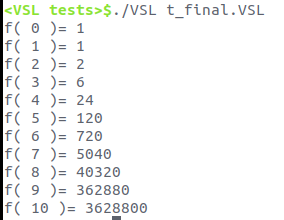

VSL: Very Simple Language  
================================  
(VSL语法见:VSL词法语法语义.doc)  
<BR>

### 编译:  
&nbsp;&nbsp;&nbsp;Linux: make&nbsp;(请确保已有llvm库,测试机版本:llvm-6.0.1)  
&nbsp;&nbsp;&nbsp;Windows: 使用cmake生成的examples/Kaleidoscope/Chapter8下的VS项目  
### 运行:  
&nbsp;&nbsp;&nbsp;./VSL [-obj] [-r] [-h] inputFile  
&nbsp;&nbsp;&nbsp;-obj: 将输入文件编译为obj文件  
&nbsp;&nbsp;&nbsp;-r:&nbsp;&nbsp;&nbsp;将输入文件的IR代码输出到IRCode.ll文件  
&nbsp;&nbsp;&nbsp;-h:&nbsp;&nbsp;&nbsp;显示帮助信息  
### 示例程序:  
```
FUNC f(n)
{
	IF n
	THEN
		RETURN n*f(n-1)
	ELSE
		RETURN 1
	FI
}

FUNC main()
{
	VAR i

	i := 0

	WHILE 11-i
	DO
	{
		PRINT "f(", i, ")=", f(i), "\n"
		i := i+1
	}
	DONE
}
```
### 输出:  
  

